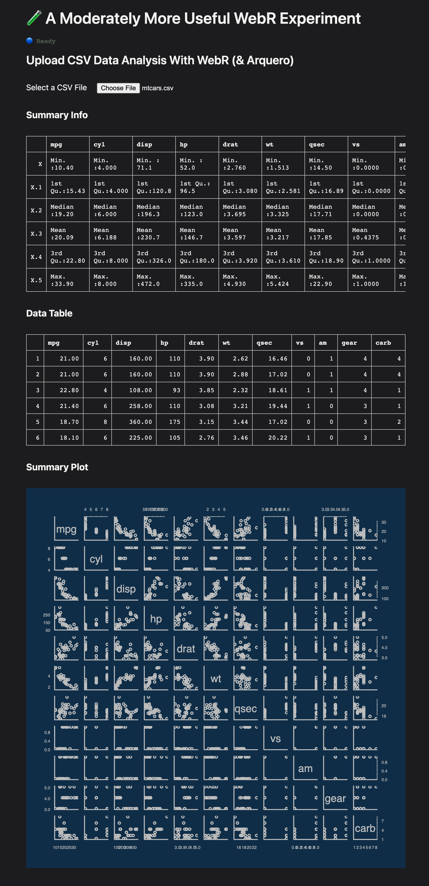

# 🧪 A Moderately More Useful WebR Experiment

>See it [live](https://rud.is/w/webr-file/) before reading!

## Getting Some Work Done

WebR will be used in many web contexts, whether it be powering dashboards without the need for a "server", filling in statistical gaps in the javascript ecosystem, or just having fun!

In this experiment, we're doing some more serious work with what may be one typical application of WebR: using it to analyze user-supplied data. This will not become a ubiquitous use case until there's a solution to the "stall" when loading packages and the ability to get more packages requiring compilation into the WebR universe. But, we can frame out the concept in a small app that:

- lets you upload a CSV
- do some analysis on it in R (which, for experiment brevity, is R's `summary()` function)
- show the first few rows of data (we'll do that with the JS arquero package just to intro that to R folks)
- use base R's `plot()` function to plot data frame using a theme from {basetheme}

Instead of including the R files from {basetheme} like we did with a previous experiment, we're riffing from @timelyportfolio's [experiment](https://main--moonlit-chimera-8d3e09.netlify.app/) where he figured out a neat way to install built packages from rOpenSci's R Universe. 

I'm a bit pressed for time this morning, so here's a just a rough guide to grok what's going on:

- `wc/file-drop.js` is a Lit component to handle the file selection and initial data reading
- `wc/file-target.js` is another Lit component to handle the displays of plots and tables
- `r.js` has some new functions which make it easier to install packages from R Universe
- `main.js` does all the package loading

I'll exposit more when time allows.

You can find the source for this experiment [on GitHub]()
